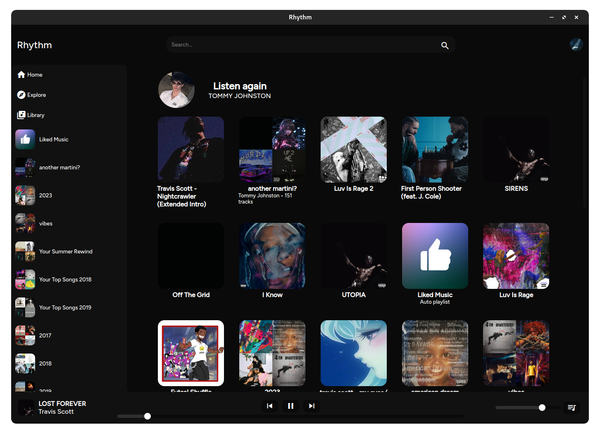

# Rhythm - YouTube Music Client
Welcome to Rhythm, a sleek and intuitive YouTube Music client designed to bring the best of YouTube Music right to your desktop. Developed with love for music and technology, Rhythm is built using HTML, CSS, and JavaScript (Using [muse](https://github.com/vixalien/muse) as a backend), wrapped up in an Electron shell for cross-platform compatibility.

## Features
* Seamless YouTube Music Integration: Access your favorite playlists, albums, and tracks directly within Rhythm.
* Cross-Platform Compatibility: Whether you're on Windows, macOS, or Linux, Rhythm ensures you can enjoy your music wherever you are.
* Responsive User Interface: Designed with modern web standards, Rhythm offers a clean and intuitive interface that adapts to your preferences.
* Discord Rich Presence is fully supported and will display the current song along with a link and artwork.

## Why?
When I decided to try out Youtube Premium, I came to find there was no desktop client for Youtube Music. The website "works", however, I found it to be very sluggish and laggy. For that reason, I decided to attempt to create my own client. In the end, I have switched back to Spotify for my musical needs, so this project is no longer a priority for me.

## Contributing
We welcome contributions from the community! Whether it's reporting issues, submitting pull requests, or simply spreading the word, every bit helps make Rhythm better. You must have a web proxy for js/worker.js in order for the API calls to work for youtube (CORS). There is a [tracking issue](https://git.tommy-johnston.com/tommy/Rhythm/issues/1) for this project as well.

## License

This project is licensed under the Attribution-NonCommercial-ShareAlike 4.0 International License - see the [LICENSE](LICENSE) file for details.
